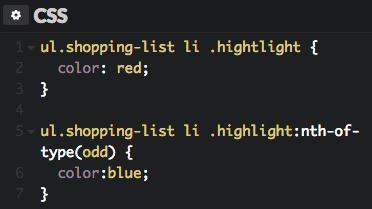

## Question A:

What color would you expect the item Sweet Halwa to show as and why?

## Question B:

What color would you expect the item "Sausage" to show as and why?

   

    

Hint: You need to view these images. To view them use one of the following techniques. These questions test your understanding of which of the competing CSS directives are used by the browser (cascading rules). You may read about these rules if you need a refresher.

- click on the preview button within VSCode (second icon from top right in VSCode; if you don't locate it, no sweat).
- view this question within github.com in the reviews repository shared with you.

### Answer A:

The color would be red:  That value is encased in an html element (span) with a class of (highlight), where the color is designated as red.

### Answer B:

(NOTE:  This is based on the assumption that A has nothing to do with B):

The color would be blue:  The span is encased in a list element tag where the id is "#must-by," which designates a color of blue.
